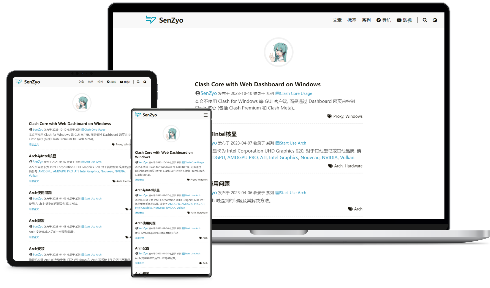

你可以像 [本仓库](https://github.com/senzyo/blog.git) 一样, 将 [DoIt](https://github.com/HEIGE-PCloud/DoIt.git) 主题添加为你的 Git 仓库的子模块: 

```bash
git submodule add https://github.com/HEIGE-PCloud/DoIt.git themes/DoIt
```

之后, 你可以通过这条命令来将主题更新至最新版本: 

```bash
git submodule update --remote --merge
```

---------------------------------------

克隆本 Git 仓库 (含有子模块的 Git 仓库) 时, 运行: 

```bash
git clone --recurse-submodules git@github.com:senzyo/blog.git
```

会自动初始化并更新 Git 仓库中的每一个子模块,  包括可能存在的嵌套子模块。

如果已经克隆了 Git 仓库但忘记了 `--recurse-submodules` , 运行: 

```bash
git submodule update --init
```

如果还要初始化、抓取并检出任何嵌套的子模块, 运行: 

```bash
git submodule update --init --recursive
```
