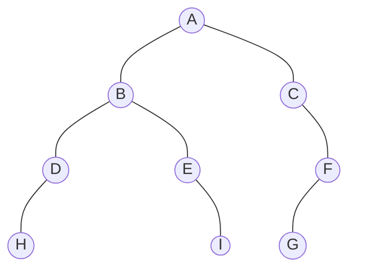

## 题目

一棵二叉树的前序遍历序列为`ABDHEICFG`, 中序遍历序列为`HDBEIACGF`, 后序遍历序列为`HDIEBGFCA`。

## 知识点

1. 必须已知二叉树的**中序**遍历序列, 才能唯一确定这棵二叉树, 题目一定会给出中序遍历序列。
2. **前序**遍历序列的**第一个**节点一定是二叉树的**根节点**, 比如节点A。
3. **后序**遍历序列的**最后一个**节点一定是二叉树的**根节点**, 比如节点A。
4. **中序**遍历序列中, 左子树节点一定在根节点的左侧, 比如HDBEI都在A的左侧；右子树节点同理。这样可避免画错二叉树。

## 正规解法

### 由前序和中序遍历序列求二叉树

1. 由前序遍历序列`ABDHEICFG`可知根节点为`A`, 又因中序遍历序列`HDBEIACGF`中, `HDBEI`都在`A`的左侧, 可知`HDBEI`都是`A`的左子树节点, 同理`CGF`都是`A`的右子树节点。

   ```mermaid
    graph TB
        A((A)) --- HDBEI
        A --- CGF
    ```

2. 对于前序遍历序列中`BDHEI`这棵子树, `B`是根节点, 由中序遍历序列`HDBEI`可知`HD`是`B`的左子树节点, `EI`是`B`的右子树节点。

   ```mermaid
    graph TB
        A((A)) --- B((B)) --- HD
        B --- EI
        A --- CGF
    ```

3. 对于前序遍历序列中`DH`这棵子树, `D`是根节点, 由中序遍历序列`HD`可知`H`是`D`的左子树节点。同理, 对于前序遍历序列中`EI`这棵子树, `E`是根节点, 由中序遍历序列`EI`可知`I`是`E`的右子树节点。

    ```mermaid
    graph TB
        A((A)) --- B((B)) --- D((D)) --- H((H))
        D ~~~ n1(( ))
        style n1 opacity:0
        B --- E((E)) ~~~ n2(( ))
        style n2 opacity:0
        E --- I((I))
        A --- CGF
    ```

4. 对于前序遍历序列中`CFG`这棵子树, `C`是根节点, 由中序遍历序列`CGF`可知`GF`是`C`的右子树节点。

    ```mermaid
    graph TB
        A((A)) --- B((B)) --- D((D)) --- H((H))
        D ~~~ n1(( ))
        style n1 opacity:0
        B --- E((E)) ~~~ n2(( ))
        style n2 opacity:0
        E --- I((I))
        A --- C((C)) ~~~ n3(( ))
        style n3 opacity:0
        C --- GF
    ```

5. 对于前序遍历序列中`FG`这棵子树, `F`是根节点, 由中序遍历序列`GF`可知`G`是`F`的左子树节点。得到答案:

    ```mermaid
    graph TB
        A((A)) --- B((B)) --- D((D)) --- H((H))
        D ~~~ n1(( ))
        style n1 opacity:0
        B --- E((E)) ~~~ n2(( ))
        style n2 opacity:0
        E --- I((I))
        A --- C((C)) ~~~ n3(( ))
        style n3 opacity:0
        C --- F((F)) --- G((G))
        F ~~~ n4(( ))
        style n4 opacity:0
    ```

### 由后序和中序遍历序列求二叉树

1. 由后序遍历序列`HDIEBGFCA`可知根节点为`A`, 又因中序遍历序列`HDBEIACGF`中, `HDBEI`都在`A`的左侧, 可知`HDBEI`都是`A`的左子树节点, 同理`CGF`都是`A`的右子树节点。

   ```mermaid
    graph TB
        A((A)) --- HDBEI
        A --- CGF
    ```

2. 对于后序遍历序列中`HDIEB`这棵子树, `B`是根节点, 由中序遍历序列`HDBEI`可知`HD`是`B`的左子树节点, `EI`是`B`的右子树节点。

   ```mermaid
    graph TB
        A((A)) --- B((B)) --- HD
        B --- EI
        A --- CGF
    ```
   
3. 对于后序遍历序列中`HD`这棵子树, `D`是根节点, 由中序遍历序列`HD`可知`H`是`D`的左子树节点。同理, 对于后序遍历序列中`IE`这棵子树, `E`是根节点, 由中序遍历序列`EI`可知`I`是`E`的右子树节点。

    ```mermaid
    graph TB
        A((A)) --- B((B)) --- D((D)) --- H((H))
        D ~~~ n1(( ))
        style n1 opacity:0
        B --- E((E)) ~~~ n2(( ))
        style n2 opacity:0
        E --- I((I))
        A --- CGF
    ```

4. 对于后序遍历序列中`GFC`这棵子树, `C`是根节点, 由中序遍历序列`CGF`可知`GF`是`C`的右子树节点。

    ```mermaid
    graph TB
        A((A)) --- B((B)) --- D((D)) --- H((H))
        D ~~~ n1(( ))
        style n1 opacity:0
        B --- E((E)) ~~~ n2(( ))
        style n2 opacity:0
        E --- I((I))
        A --- C((C)) ~~~ n3(( ))
        style n3 opacity:0
        C --- GF
    ```

5. 对于后序遍历序列中`GF`这棵子树, `F`是根节点, 由中序遍历序列`GF`可知`G`是`F`的左子树节点。

    ```mermaid
    graph TB
        A((A)) --- B((B)) --- D((D)) --- H((H))
        D ~~~ n1(( ))
        style n1 opacity:0
        B --- E((E)) ~~~ n2(( ))
        style n2 opacity:0
        E --- I((I))
        A --- C((C)) ~~~ n3(( ))
        style n3 opacity:0
        C --- F((F)) --- G((G))
        F ~~~ n4(( ))
        style n4 opacity:0
    ```

## 奇技淫巧

1. 画一张表, 在第一列, 从上到下填入**前序**遍历序列 (或者从下到上填入后序遍历序列)。
2. 在第一行, 从左到右填入**中序**遍历序列。
3. 当行与列的节点相同时, 即确定该节点位置, 最后按照位置关系将节点连线得到二叉树。
4. 连接时, 注意核实各节点相对于其父节点的左右位置。

   > **中序**遍历序列中, 左子树节点一定在根节点的左侧, 比如HDBEI都在A的左侧；右子树节点同理。

| 前序和中序 | H   | D   | B   | E   | I   | A   | C   | G   | F   |
| ---------- | --- | --- | --- | --- | --- | --- | --- | --- | --- |
| A          |     |     |     |     |     | A   |     |     |     |
| B          |     |     | B   |     |     |     |     |     |     |
| D          |     | D   |     |     |     |     |     |     |     |
| H          | H   |     |     |     |     |     |     |     |     |
| E          |     |     |     | E   |     |     |     |     |     |
| I          |     |     |     |     | I   |     |     |     |     |
| C          |     |     |     |     |     |     | C   |     |     |
| F          |     |     |     |     |     |     |     |     | F   |
| G          |     |     |     |     |     |     |     | G   |     |

| 后序和中序 | H   | D   | B   | E   | I   | A   | C   | G   | F   |
| ---------- | --- | --- | --- | --- | --- | --- | --- | --- | --- |
| A          |     |     |     |     |     | A   |     |     |     |
| C          |     |     |     |     |     |     | C   |     |     |
| F          |     |     |     |     |     |     |     |     | F   |
| G          |     |     |     |     |     |     |     | G   |     |
| B          |     |     | B   |     |     |     |     |     |     |
| E          |     |     |     | E   |     |     |     |     |     |
| I          |     |     |     |     | I   |     |     |     |     |
| D          |     | D   |     |     |     |     |     |     |     |
| H          | H   |     |     |     |     |     |     |     |     |

得到答案:


